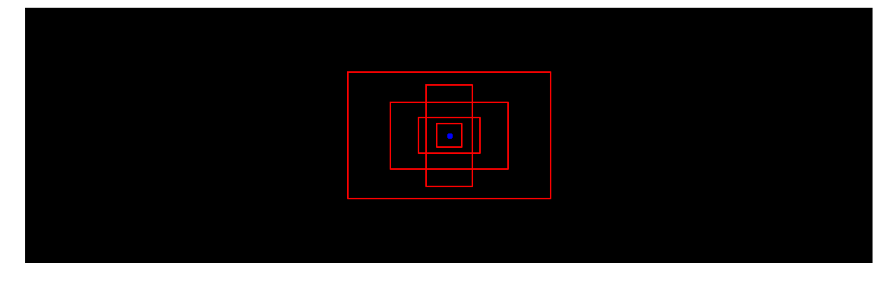
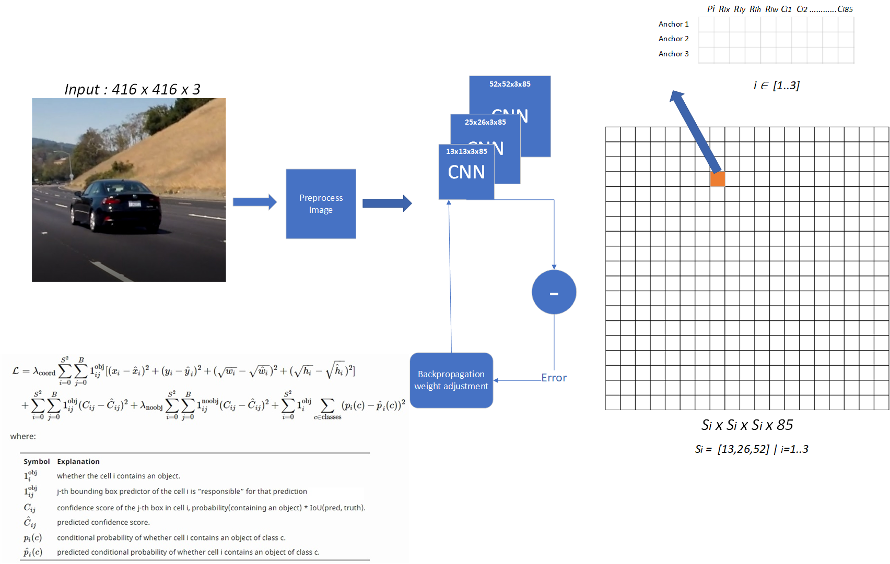
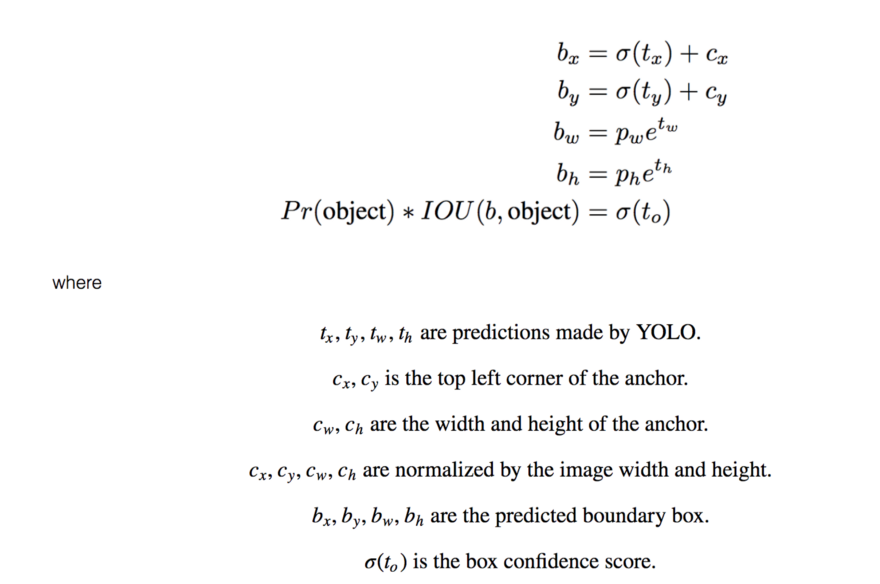

## Writeup Template
### Author : Kiril Cvetkov


| Project Video	|  Yolo V2  |  Yolo V3   |  Custom Video   |
|:-----------:|:----------:|:---------:|:---------:|
| [](https://www.youtube.com/watch?v=26H7qdBbTls)   	| [](https://www.youtube.com/watch?v=BiFTq9DPSE0)| [](https://www.youtube.com/watch?v=Pjja4e8vPp0) | [](https://www.youtube.com/watch?v=1SU1MLMNfAI) | 

---

**Vehicle Detection Project**

The goals / steps of this project are the following:

* Perform a Histogram of Oriented Gradients (HOG) feature extraction on a labeled training set of images and train a classifier Linear SVM classifier
* Optionally, you can also apply a color transform and append binned color features, as well as histograms of color, to your HOG feature vector. 
* Note: for those first two steps don't forget to normalize your features and randomize a selection for training and testing.
* Implement a sliding-window technique and use your trained classifier to search for vehicles in images.
* Run your pipeline on a video stream (start with the test_video.mp4 and later implement on full project_video.mp4) and create a heat map of recurring detections frame by frame to reject outliers and follow detected vehicles.
* Estimate a bounding box for vehicles detected.

[//]: # (Image References)
[image1]: ./YoloV2/notebook_images/architecture.png
[image2]: ./YoloV2/notebook_images/clustering.png
[image3]: ./YoloV2/notebook_images/iou.png
[image4]: ./YoloV2/notebook_images/nms_algo.jpg
[image5]: ./YoloV2/notebook_images/probability_extraction.png
[image6]: ./YoloV2/notebook_images/rectangle.png
[image7]: ./YoloV2/notebook_images/yolo.png
[image8]: ./YoloV3/notebook_images/architecture.png
[image9]: ./YoloV3/notebook_images/formula.png
[image10]: ./documentation/hog.png
[image11]: ./documentation/sliding_window.png
[image12]: ./documentation/examples.png

### Histogram of Oriented Gradients (HOG)

#### 1. Explanation of how I extracted HOG features from the training images.


I started by reading in all the `vehicle` and `non-vehicle` images. 

First and foremost we need to extract several types of features from the image and concatenate them into one vector, representing the image in the multi-dimensional space, ready for classification

The histogram of oriented gradients (HOG) is a feature descriptor used in computer vision and image processing for the purpose of object detection. The technique counts occurrences of gradient orientation in localized portions of an image. This method is similar to that of edge orientation histograms, scale-invariant feature transform descriptors, and shape contexts, but differs in that it is computed on a dense grid of uniformly spaced cells and uses overlapping local contrast normalization for improved accuracy.

The hog features extractor is supported in `skimage` framework and it is implemented in `cv_utils.py:get_hog_features (Line:17 - Line:32)
     
Here is an example using the `YUV` color space and HOG parameters : 

![alt text][image10]

#### 2. How you I settled my final choice of HOG parameters.

I tried various combinations of parameters, some parameters were bringing good results in classification, but decreasing the train/prediction time and vice versa, so the parameters below brought me :
* validation accuracy : 98.4
* fast train/test time

Bellow are the parameter combination I used for extracting the hog features for my project.                   
* Picture Color Space = 'YUV'
* Orient = 11
* Pixels per cell = (16,16)
* Cells per block = (2,2)

#### 3. Describtion how  I trained a classifier using my selected HOG features
I trained a linear SVM using only the `hog features`. First and foremost my goal was to achieve 7+ FPS(frames per sedconds), with fair performance on my Intel i5 8600K.

The full code is inside the main Notebook.py file, under `Generate dataset and train the model heading`.
I scaled the features values since the range of all features should be normalized so that each feature contributes approximately proportionately to the final distance.
Then I used the Linear SVC method which is, in fact, sklearn implementation for Linear Support Vector Classification.
The classifier is implemented so it has more flexibility in the choice of penalties and loss functions and should scale better to large numbers of samples.


Code: 
```
    # Fit a per-column scaler
    X_scaler = StandardScaler().fit(X_train)
    # Apply the scaler to X
    X_train = X_scaler.transform(X_train)
    X_test = X_scaler.transform(X_test)

    print('Using:',orient,'orientations',pix_per_cell,
        'pixels per cell and', cell_per_block,'cells per block')
    print('Feature vector length:', len(X_train[0]))
    # Use a linear SVC 
    svc = LinearSVC()
    # Check the training time for the SVC
    t=time.time()
    svc.fit(X_train, y_train)
    t2 = time.time()
```    
    
    

### Sliding Window Search

#### 1. Describtion about how I implemented a sliding window search and how did I decide what scales to search and how much to overlap windows.

The full code is available in cv_utils.py:find_cars (Line:115 - Line:179)

* Input [YMin, YMax, Scale]
* Initialize rectangles to empty list
* Precompute the Hog Features for the entire image
* Foreach portion window in `YMin` `YMax` region: 
     * Select the portion of the hog features
     * Subsample the features according to the size of the window
     * Classify Features
     * If Classifier is 1
          * Append the window region to rectangles list with factor `scale`
    

I use composition on three search scales, using YUV color channel, and these parameters were chosen carefully according to:
* Fair accuracy on Test images 
* Fair processing/search speed


Below is the result of the input/output sliding window search : 
![alt text][image11]

#### Examples of test images and optimizing performance
 Below  are some examples of test images to demonstrate how my pipeline is working. What I did to optimize the performance of my classifier?

I use composition on three search scales, using YUV which were choosen carefully according to:
* Fair accuracy on Test images 
* Fair processing/search speed

* Box Search 1
     * YMin = 400  
     * YMax = 500  
     * scale = 1.5  

* Box Search 2
     * YMin = 400  
     * YMax = 550  
     * scale = 2.0  

* Box Search 3
     * YMin = 400  
     * YMax = 600  
     * scale = 3.5
     
Here are some example images:

![alt text][image12]

#### Classifier optimization
For optimizing the classifier I tried various combinations of parameters, some parameters were bringing good results in classification, but decreasing the train/prediction time and vice versa, so I played with Orient and Pixel per cell arguments and color channel,
Changing the pixels_per_cell parameter from 8 to 16 produced a roughly ten-fold increase in execution train/test speed with minimal cost to accuracy.
Using YUV as a color channel I got validation accuracy: 98.4


---

### Video Implementation

#### 1. Provide a link to your final video output.  Your pipeline should perform reasonably well on the entire project video (somewhat wobbly or unstable bounding boxes are ok as long as you are identifying the vehicles most of the time with minimal false positives.)
Here's a [link to my video result](https://www.youtube.com/watch?v=26H7qdBbTls)


#### 2. Describe how (and identify where in your code) you implemented some kind of filter for false positives and some method for combining overlapping bounding boxes.

I recorded the positions of positive detections in each frame of the video.  From the positive detections I created a heatmap and then thresholded that map to identify vehicle positions.  I then used `scipy.ndimage.measurements.label()` to identify individual blobs in the heatmap.  I then assumed each blob corresponded to a vehicle.  I constructed bounding boxes to cover the area of each blob detected.  

Since I used a lot of techniques to speed up the processing time to 7 FPS, we lose valuable data. 
However, this costed me to get more false positives and true negatives.
In order to improve performance on false positives and to enhance labeling I constructed the following algorithm : 

Source : cv_utils#draw_labeled_bboxes (Line 265 - Line : 356)
``` Pseudo - Code
[Input : previous_frame_rectangles, current_frame_rectangles]
[Initialize : list alive_rectangles]

for all rectangles in current_frame_rectangles:
     closest_rectangle =  closest rectangle from previous_frame_rectangles
     if distance(previous_rectangle, closest_rectangle) > THRESHOLD:
          we have a new rectangle
          create new rectangle as new_rectangle
          new_rectangle.remove_count=10
          append new_rectangle to alive_rectangles list
     else 
          append closest_rectangle to alive_rectangles list

//remove all outdated rectangles
for all rectangles in (previous_frame_rectangle-current_frame_rectangles):
     if rectangle.remove_count==0
          remove rectangle
     else
          append rectangle to alive_rectangles list
     rectangle.remove_count--
     
//updated all alive rectangles
for all rectangles in alive_rectangles :
     //if rectangl is updating current position
     if rectangle.step_count>0 :
          update position to the next delta step
          rectangle.step_count--
     else 
          get rectangle current frame position
          add smooth animation effect from current position to current frame position
          rectangle.step_count=20 (It will perform in the next 20 frames)
     
     rectangle.start_count++
     if rectangle.start_count>5 
          draw rectangle
     
previous_frame_rectangles = alive_rectangles
```
---

### Discussion

#### 1. Briefly discussion about problems / issues I faced in my initial implementation of this implementation.  Where will my pipeline likely fail?  What could you do to make it more robust?

First and foremost, The biggest problem of this pipeline is that it's hard for us to create a composition of features or applying filters that will work fine on all road conditions, lights, shadows, noise. 
Second, The sliding window algorithm is not optimal, and it cost us a lot of processing time.
So with 7FPS, I can say that I have poor performance and poor quality of my algorithm.

My journey has just started here,
I readed lot about RCNN and YOLO algorithm, and bellow is implementation and explanation of YOLO V2 and V3 for this project.


### Yolo V2. [Notebook YoloV2](./YoloV2/Notebook.ipynb)


#### Introduction
Integration of (https://arxiv.org/abs/1506.02640) and Redmon and Farhadi, 2016 (https://arxiv.org/abs/1612.08242). 

YOLO stands for You Only Look Once. It's an object detector that uses features learned by a deep convolutional neural network to detect an object. Before we get out hands dirty with code, we must understand how YOLO works.


#### Architercutre details

Bounding box exmple :


In this project, I use pretrained weights, where we have 80 trained yolo classes, for recognition.  
The class label is represented as `c` and it's an integer from 1 to 80, each number represent the class label accordingly.  
If `c=3`, then the classified object is a `car`


Neural network io:
-  **input** : (m, 608, 608, 3)
-  **output** : confidece of an object being present in the rectangle, list of rectangles position and sizes and classes of the objects begin detected. Each bounding box is represented by 6 numbers `(Pc, Rx, Ry, Rh, Rw, C1..Cn)` as explained above. In this case n=80, which means we have `c` as 80-dimensional vector, and the final size of representing the bounding box is 85 


Let us consider an input, where the input image is 608 x 608, and stride of the network is 32. As pointed earlier, the dimensions of the feature map will be 13 x 13. We then divide the input image into 19 x 19 cells.


For keeping the things simple we will flatten the last two dimensions, from (19, 19, 5, 85) the output of our CNN is flatten to (19, 19, 425).

Now, for each box (of each cell) we will compute the following elementwise product and extract a probability that the box contains a certain class.


#### Find the class detected by each box

Here's one example visualizing what YOLO can predict on an image:
- For each of the `SxS` (19x19) grid cells, find the maximum of the confidence scores (taking a max across both the 5 anchor boxes and across different classes).  
A confidence score is: probability(containing an object) x IoU(pred, truth).
If the cell contains an object, it predicts a probability of this object belonging to one class Ci, i=1,2,…, K: probability(the object belongs to the class Ci | containing an object). At this stage, the model only predicts one set of class probabilities per cell, regardless of the number of boxes B. 
- Color that grid cell according to what object that grid cell considers the most likely.
- Draw rectangle 


<caption> Each of the `SxS` (19x19) grid cells colored according the class that has the largest predicted probability in specified cell.</caption>


#### Filtering with a threshold on class scores

The output result may contain several rectangles that are false positives or overlap, so we need to find a way to reduce them.
The first attempt to reduce these rectangles is to filter them by a threshold.

##### Non-max suppression 

Even after yolo filtering by thresholding over, we still have a lot of overlapping boxes. Second approach and filtering is Non-Max suppression algorithm.

Let's write the general algorithm : 
* Get Yolo CNN output
* Discard all boxes with `Pc <= 0.6`  
* While there are any remaining boxes : 
    * Pick the box with the largest `Pc`
    * Output that as a prediction
    * Discard any remaining boxes with `IOU>=0.5` with the box output in the previous step

<center></center>
<caption>Example of non max suppression algorithm, on input the aglorithm receive 4 overlapping bounding boxes, and the output returns only one</caption>

Non-max suppression uses the very important function called **"Intersection over Union"**, or IoU.
<center></center>


#### Anchor Boxes

Generating anchor boxes using K-means clustering

There are many ways to compute bounding boxes for detection tasks. One approach is to directly predict the bounding box values, however this approach is susceptible to errors as it tends to favor bounding boxes with large dimensions. Further, the training process is unstable because the range of values to predict can vary significantly.In YOLOv2, the first step is to compute good candidate anchor boxes. This is achieved using K-means clustering. However, using direct Euler distance metric for K-means minizers error for larger bounding boxes, but not for smaller boxes. Therefore, in YOLOv2, intersection over union (IOU) is used as a distance metric. The IOU calculations are made assuming all the bounding boxes are located at one point, i.e. only width and height are used as features. Figure below shows the height and width plotted against each other. Fixed slopes indicate that most bounding boxes have specific predefined aspect ratios, and size. This is not surprising given the fact that a person and vehicle are expected to have certain fixed dimensions.


<center></center>


In Yolo V2, this specialization is ‘assisted’ with predefined anchors as in Faster-RCNN. The predefined anchors are chosen to be as representative as possible of the ground truth boxes, with the following K-means clustering algorithm to define them:

* all ground-truth bounding boxes are centered on (0,0)

* the algorithm initiates 5 centroids by drawing randomly 5 of the ground-truth bounding boxes

* then, the following two steps are alternated:

    * each ground truth box is assigned to one of the centroid, using as distance measure the IOU, in order to get 5 clusters or groups of ground-truth bounding boxes

    * new centroids are computed by taking the box inside each cluster that minimizes the mean IOU with all other boxes inside the cluster

To determine the priors, YOLOv2 applies k-means cluster. Then it pre-select 5 clusters. For COCO, the width and height of the anchors are (0.57273,0.677385),(1.87446,2.06253 ),(3.33843,5.47434),(7.88282,3.52778),(62×45),(9.77052,9.16828 )
and they are relative to the final feature map 

#### Installation :
* Install the packets in requirements.txt file
* Download the weights
* Convert the weights with the provided script
* Load the weights in keras

##### Download the weights

For the purpose of this project, I'm using a pretrained weights for Yolo V2.
You can download the weights <a href = "http://pjreddie.com/media/files/yolo.weights"> here</a>

These weights are generated using pure numpy arrays, but luckily the authors of Yolo provided configuration files containing the full model information, which means we can convert the weights in any high-level program language.
Allan Zelener wrote a function for weights conversion, which works well for Yolo V2, and I provided small modifications for Yolo V3 References are at the end of this notebook.

**Once the download finish, please put the weights file to YoloV2 folder**

##### Convert the weights with the provided script
```
./script.py yolo.cfg yolo.weights model_data/yolo.h5
```

##### Loading a pretrained model
See notebook : 
[Notebook YoloV2](./YoloV2/Notebook.ipynb)


### Yolo V3. [Notebook YoloV3](./YoloV3/Notebook.ipynb)

#### Architercutre details modification

Neural network io:
-  **input** : (m, 416, 416, 3)
-  **output** : confidece of an object being present in the rectangle, list of rectangles position and sizes and classes of the objects begin detected. Each bounding box is represented by 6 numbers `(Pc, Rx, Ry, Rh, Rw, C1..Cn)` as explained above. In this case n=80, which means we have `c` as 80-dimensional vector, and the final size of representing the bounding box is 85 

The first detection is made by the 82nd layer. For the first 81 layers, the image is down sampled by the network, such that the 81st layer has a stride of 32. If we have an image of 416 x 416, the resultant feature map would be of size 13 x 13. One detection is made here using the 1 x 1 detection kernel, giving us a detection feature map of 13 x 13 x 3 x 85.

Then, the feature map from layer 79 is subjected to a few convolutional layers before being up sampled by 2x to dimensions of 26 x 26. This feature map is then depth concatenated with the feature map from layer 61. Then the combined feature maps is again subjected a few 1 x 1 convolutional layers to fuse the features from the earlier layer (61). Then, the second detection is made by the 94th layer, yielding a detection feature map of 26 x 26 x 3 x 85.

A similar procedure is followed again, where the feature map from layer 91 is subjected to few convolutional layers before being depth concatenated with a feature map from layer 36. Like before, a few 1 x 1 convolutional layers follow to fuse the information from the previous layer (36). We make the final of the 3 at 106th layer, yielding feature map of size 52 x 52 x 3 x 85.

YOLO v3, in total, uses 9 anchor boxes. Three for each scale. 



<caption> Note : The last three terms of the loss function in YOLO v2 are the squared errors, whereas in YOLO v3, they’ve been replaced by cross-entropy error terms. In other words, object confidence and class predictions in YOLO v3 are now predicted through logistic regression.  
YOLO v3, in total, uses 9 anchor boxes. Three for each scale</caption>  

---------------------------------------


#### Anchor Boxes modification

Generating anchor boxes using K-means clustering

YOLO v3, in total uses 9 anchor boxes. Three for each scale. If you’re training YOLO on your own dataset, you should go about using K-Means clustering to generate 9 anchors.

Then, arrange the anchors is descending order of a dimension. Assign the three biggest anchors for the first scale, the next three for the second scale, and the last three for the third.


We make predictions on the offsets to the anchors. Nevertheless, if it is unconstrained, our guesses will be randomized again. YOLO predicts 5 parameters (tx, ty, tw, th, and to) and applies the sigma function to constraint its possible offset range.



To determine the priors, YOLOv3 applies k-means cluster. Then it pre-select 9 clusters. For COCO, the width and height of the anchors are (10×13),(16×30),(33×23),(30×61),(62×45),(59× 119),(116 × 90),(156 × 198),(373 × 326). These 9 priors are grouped into 3 different groups according to their scale. Each group is assigned to a specific feature map above in detecting objects.

**References**: 
- Joseph Redmon, Santosh Divvala, Ross Girshick, Ali Farhadi - [You Only Look Once: Unified, Real-Time Object Detection](https://arxiv.org/abs/1506.02640) (2015)
- Joseph Redmon, Ali Farhadi - [YOLO9000: Better, Faster, Stronger](https://arxiv.org/abs/1612.08242) (2016)
- Allan Zelener - [YAD2K: Yet Another Darknet 2 Keras](https://github.com/allanzelener/YAD2K)
- The official YOLO website (https://pjreddie.com/darknet/yolo/) 
- Vivek Yadav [<a href="https://medium.com/@vivek.yadav/part-1-generating-anchor-boxes-for-yolo-like-network-for-vehicle-detection-using-kitti-dataset-b2fe033e5807">Generating Anchor boxes for Yolo-like network for vehicle detection using KITTI dataset]</a>
- Christopher Bourez's blog [<a href="http://christopher5106.github.io/object/detectors/2017/08/10/bounding-box-object-detectors-understanding-yolo.html">Bounding box object detectors: understanding YOLO, You Look Only Once</a>]
- Andrew NG Coursera : [<a href="https://www.coursera.org/learn/convolutional-neural-networks">Convolutional Neural Networks
</a>]
- Jonathan Hui : [<a href="https://medium.com/@jonathan_hui/real-time-object-detection-with-yolo-yolov2-28b1b93e2088">Real-time Object Detection with YOLO, YOLOv2 and now YOLOv3
</a>]
